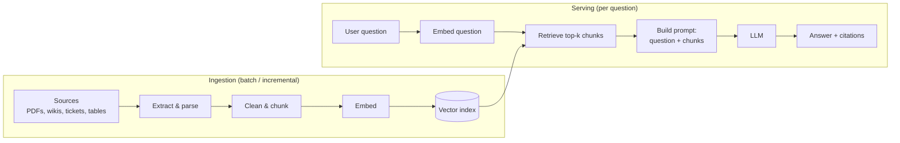

# RAG is just ETL with a new sink

*Sprint 2 article · ~8 min read*

If you have built data pipelines, you already understand most of **retrieval-augmented generation (RAG)**. The vocabulary is new, but the pipeline is familiar: extract from sources, transform into the right grain, load into a store built for the query pattern, and serve it to a consumer.

The consumer just happens to be a large language model.

## The problem RAG solves

An LLM only knows what was in its training data. It doesn't know your company's policies, your product catalogue, or last week's incident reports. You have two options:

- **Retrain or fine-tune the model** on your data. This is expensive and slow, and it's stale the moment the data changes.
- **Look up the relevant data at question time and hand it to the model** along with the question. That's RAG.

In data terms: instead of baking the data into the application, you **join it in at query time**.

## The pipeline, stage by stage



### 1. Extract: same as always

Connectors to SharePoint, Confluence, S3, ticketing systems and databases. You already know the problems: authentication, incremental loads, deleted records, and source owners who don't reply.

**What's new:** most sources are *unstructured*. Parsing PDFs, slides and HTML into clean text is often the hardest part of the project, and it's where quality is won or lost.

### 2. Transform: chunking is choosing the grain

You can't hand the model a 200-page manual. You split documents into **chunks** (say, a few hundred words each, often with some overlap) and retrieve only the relevant ones.

This is a **grain decision**, exactly like modelling a fact table:

- **Too coarse** (whole documents): retrieval returns lots of irrelevant text, it wastes the model's context window, and answers get vague.
- **Too fine** (single sentences): chunks lose their context. "It must be approved within 5 days" — what must?
- **Right grain:** a self-contained unit of meaning, such as a policy section, a FAQ entry or a procedure step.

Also enrich each chunk with **metadata**: source, section title, date, owner and access level. These are your dimension attributes, and you'll filter on them.

### 3. Embed: a derived column

An **embedding** is a list of numbers (a vector) that represents the *meaning* of a piece of text. Texts with similar meanings get vectors that are close together.

Treat it as a **derived column**, computed by an embedding model:

```text
chunk_id | source | section | text | embedding_model | embedding (vector)
```

The data-engineering consequence: **the embedding depends on the model version.** Change the embedding model and every vector must be recomputed. It's a full reprocess, like a breaking schema migration. Store the model name alongside the vector.

### 4. Load: the vector index is the new sink

A **vector index** is a store optimised for one query: *"find the k rows whose vectors are closest to this vector."*

Options range from dedicated vector databases to features in stores you already run, e.g. Postgres with `pgvector`, or Databricks Mosaic AI Vector Search. The Databricks version can sync incrementally from a Delta table, which is exactly the CDC pattern you already use.

### 5. Serve: retrieval plus generation

At question time:

1. Embed the user's question with the **same** embedding model.
2. Retrieve the top-k closest chunks, filtered by metadata (e.g. only the documents this user is allowed to see).
3. Build a prompt: instructions + retrieved chunks + question.
4. The LLM writes an answer grounded in those chunks, ideally with citations.

## A minimal version in Python

A deliberately simplified sketch that shows the shape, not production code:

```python
import anthropic

client = anthropic.Anthropic()          # reads ANTHROPIC_API_KEY from env
MODEL = "your-claude-model-id"          # check docs.claude.com for current model names

# --- Ingestion (run as a batch / incremental job) ---
def chunk(text: str, size: int = 300, overlap: int = 50) -> list[str]:
    words = text.split()
    step = size - overlap
    return [" ".join(words[i:i + size]) for i in range(0, len(words), step)]

def ingest(doc_id: str, text: str, metadata: dict):
    for n, piece in enumerate(chunk(text)):
        vector = embed(piece)            # your embedding provider (e.g. Voyage AI)
        vector_index.upsert(             # your vector store
            id=f"{doc_id}-{n}", vector=vector,
            metadata={**metadata, "text": piece},
        )

# --- Serving (per question) ---
def answer(question: str, user_groups: list[str]) -> str:
    hits = vector_index.query(
        vector=embed(question), top_k=5,
        filter={"access_group": {"$in": user_groups}},   # permission-aware retrieval
    )
    context = "\n\n".join(
        f"[{h.metadata['source']}] {h.metadata['text']}" for h in hits
    )
    response = client.messages.create(
        model=MODEL,
        max_tokens=800,
        messages=[{
            "role": "user",
            "content": (
                "Answer using ONLY the context below. Cite sources in [brackets]. "
                "If the answer isn't in the context, say you don't know.\n\n"
                f"Context:\n{context}\n\nQuestion: {question}"
            ),
        }],
    )
    return response.content[0].text
```

`embed()` and `vector_index` are placeholders for whichever embedding provider and vector store you choose. Anthropic's documentation points to Voyage AI for embeddings.

## What carries over from data engineering

| Data engineering practice | In RAG |
|---|---|
| Incremental loads / CDC | Re-embed only changed documents; delete vectors for deleted documents |
| Row-level security | Filter retrieval by the user's permissions. **Never** retrieve what the user can't see and rely on the prompt to hide it. |
| Lineage | Keep `source` and `section` on every chunk so answers can cite them |
| Data-quality tests | Evaluation sets (see below) |
| Schema versioning | Version the embedding model and chunking strategy |
| Freshness SLA | "The index reflects source changes within X hours" |

## Where the analogy breaks

Be honest about the parts that are genuinely new:

- **Retrieval is by meaning, not by key.** There's no exact join. It's always "closest match", so you can get plausible but wrong chunks.
- **Output is probabilistic.** The same question can produce differently worded answers. You test with **evaluation sets** (50–200 real questions with known good answers) and measure rates. A single assertion won't do.
- **There are two failure points.** Bad retrieval (the right chunk wasn't found) and bad generation (the chunk was found but the answer is wrong) need separate metrics. Measure retrieval first, because most problems start there.
- **The context window is a budget.** Every chunk you retrieve costs tokens (money and latency) and competes for the model's attention. More isn't better.

## Takeaway

> RAG is a data pipeline with a probabilistic consumer. If you can build a reliable, governed, incremental ETL pipeline, you can build 80% of a RAG system. The remaining 20% is chunking, retrieval tuning and evaluation, and that's where to spend your learning time.

---

*Next: [Agents as non-deterministic DAGs](../agents/overview.md)*
